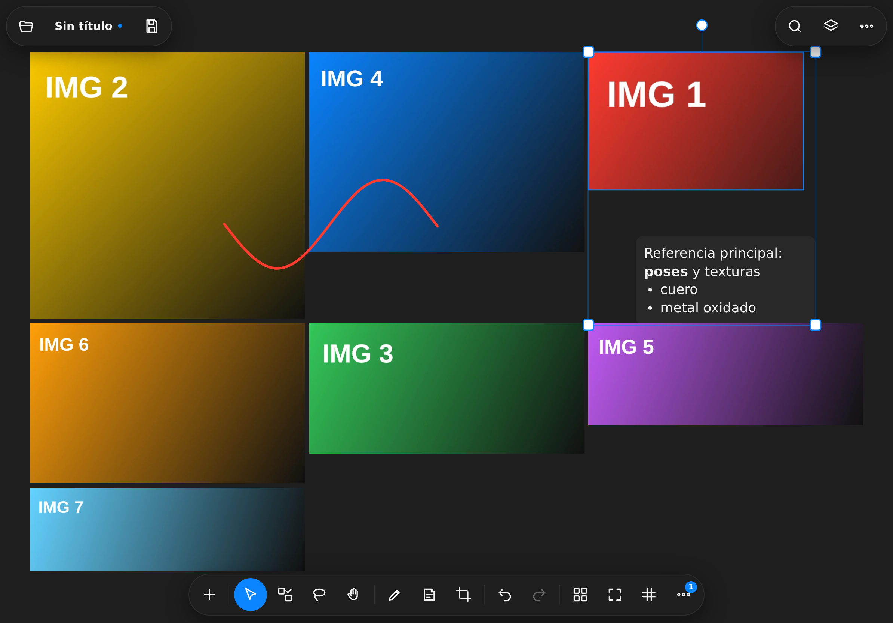
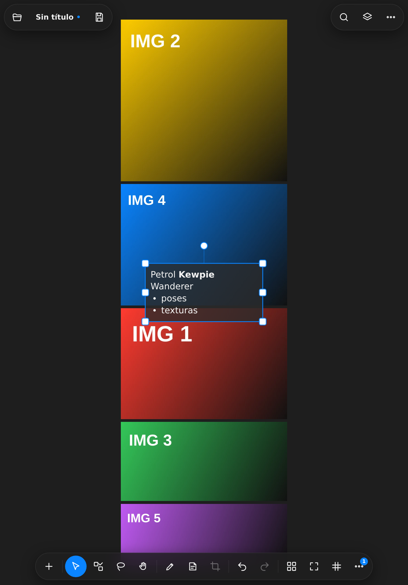
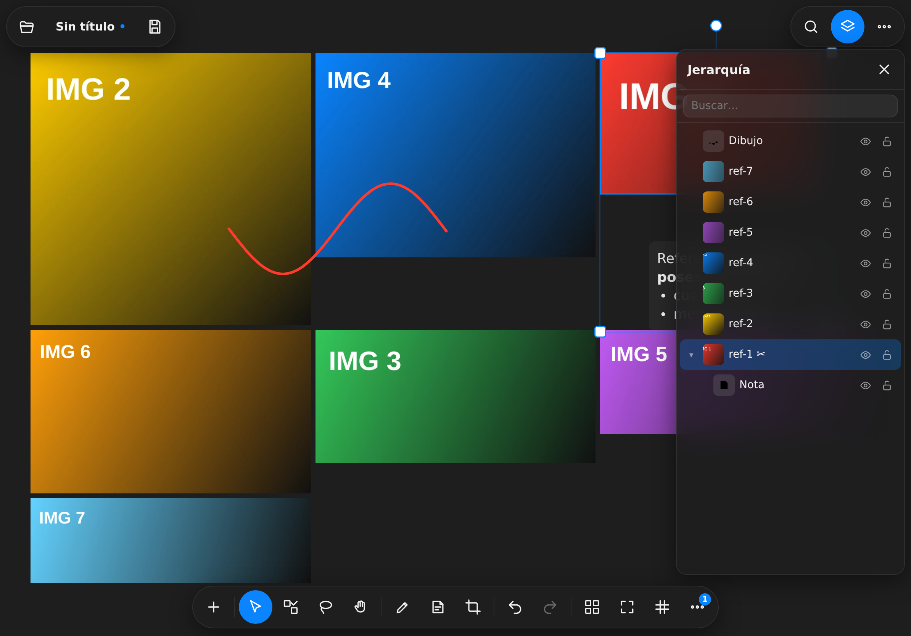
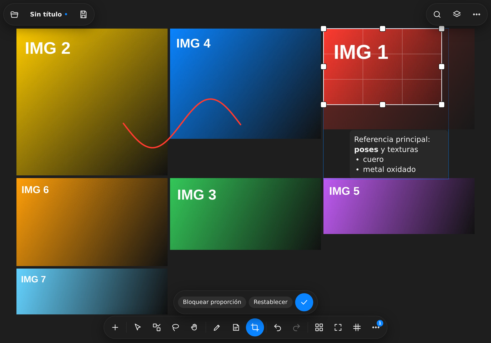
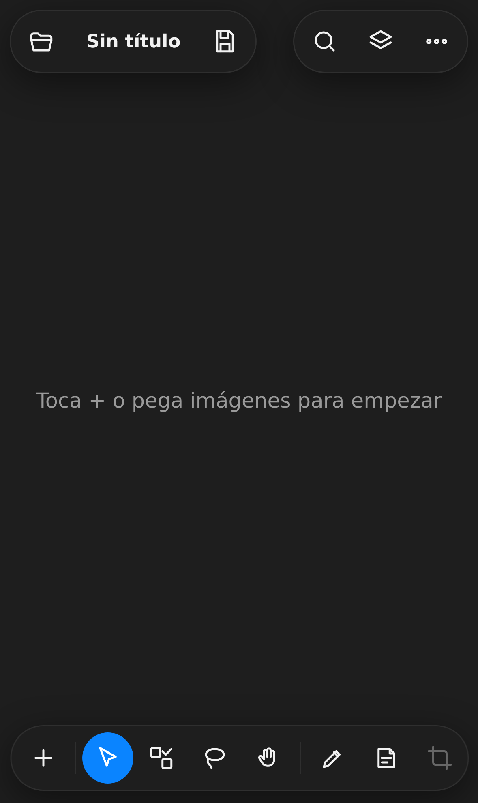
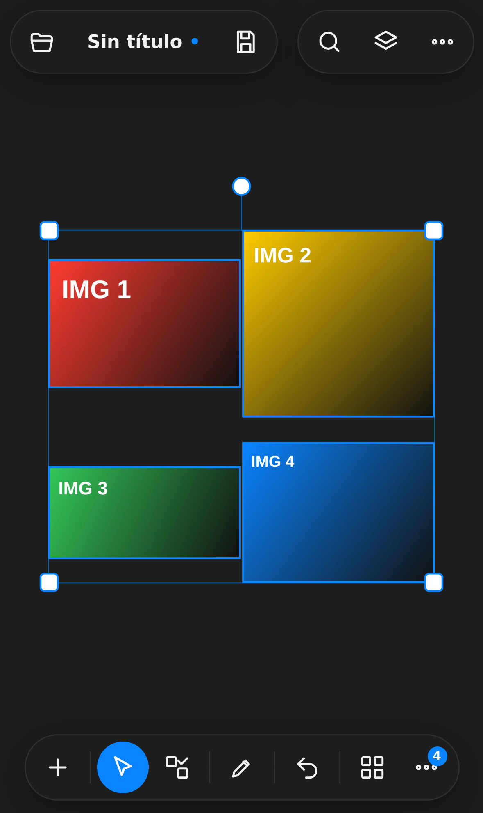

# Moodboard

Tablero de referencias visuales para iPad y iPhone. Lienzo infinito con imágenes, notas,
dibujos, grupos y organización automática, pensado desde el primer día para dedo y Apple
Pencil, no para mouse y ventanas.

Es una PWA en TypeScript + Vite + Canvas 2D, envuelta con Capacitor para publicarse en la
App Store. Todo funciona sin conexión y sin backend: las escenas y los bitmaps viven en
IndexedDB, en el dispositivo.

## Capturas

| | |
|---|---|
|  |  |
| Organizar: óptimo sobre una selección en iPad | Nota hija de una imagen, con markdown ligero |
|  |  |
| Menú contextual de selección (pulsación larga) | Recorte con gizmo y bloqueo de proporción |
|  |  |
| Lienzo vacío en iPhone | El mismo tablero en iPhone |

## Stack y por qué

| Pieza | Elección | Motivo |
|---|---|---|
| UI | TypeScript sin framework + DOM mínimo (`src/ui/dom.ts`) | El lienzo es Canvas; el HTML solo aporta barras y diálogos. Un framework agregaría peso y re-render inútil. |
| Lienzo | Canvas 2D con `devicePixelRatio` | Suficiente para cientos de ítems, funciona en todos los Safari y evita el costo de arranque de WebGL. |
| Build | Vite 6 + `vite-plugin-pwa` (Workbox) | Dev server con HMR, build a `dist/` y service worker con `registerType: 'autoUpdate'`. |
| Almacenamiento | IndexedDB vía `idb` (stores `scenes`, `blobs`, `kv`) | Offline-first real: los bitmaps son `Blob`, no base64, y se comparten entre escenas. |
| Archivo | `.moodboard` = ZIP con `fflate` (`scene.json` + `blobs/`) | Formato abierto, inspeccionable, sin dependencias nativas. |
| Empaque iOS | Capacitor 7 (`cl.nicopinto.moodboard`) | La misma base sirve como PWA instalable hoy desde Safari y como app firmada para TestFlight/App Store. |
| Pruebas | Vitest + jsdom | Los módulos pesados (paleta, phash, organizar, formato de archivo, cliente IA) son puros y se prueban sin navegador. |

Sin backend: no hay cuentas, no hay servidor, no sale nada del dispositivo salvo las
imágenes que tú importes desde una URL y, si la activas, las llamadas a la API de Anthropic
con tu propia clave.

## Sincronización entre dispositivos

La app funciona sin cuenta y sin servidor. En la versión nativa para iPhone e iPad,
los tableros se guardan en tu propio iCloud Drive (Archivos → iCloud Drive → Moodboard)
y se sincronizan solos entre tus dispositivos, sin crear cuentas nuevas ni configurar nada.
En la versión web (PWA) no hay sincronización automática: puedes exportar un tablero
como `.moodboard` y enviarlo por AirDrop. Detalles en [docs/SYNC.md](docs/SYNC.md).

## Instalación en iPad / iPhone

1. Abre la URL donde esté publicada la app en **Safari** (no Chrome: solo Safari instala PWAs en iOS).
2. Toca **Compartir** → **Añadir a pantalla de inicio**.
3. Ábrela desde el ícono: corre a pantalla completa (`display: standalone`), sin barras del navegador, y sigue funcionando sin conexión.

La app pide almacenamiento persistente al arrancar (`navigator.storage.persist()`) para que
iOS no purgue los datos cuando falte espacio. Si el sistema lo niega, lo avisa en Ajustes.

Para la versión nativa (App Store / TestFlight), ver [docs/IOS.md](docs/IOS.md).

## Desarrollo

```bash
npm install        # dependencias
npm run dev        # servidor de desarrollo (vite --host, accesible desde el iPad)
npm test           # vitest run
npm run build      # tsc --noEmit + vite build → dist/
npm run preview    # sirve dist/ para probar el service worker
```

`npm run lint` es `tsc --noEmit` (TypeScript en modo `strict`, sin locals ni parámetros sin usar).

Para probar en el iPad sin Mac: `npm run dev -- --host` y abre `http://<ip-del-mac-o-pc>:5173`
en Safari. Ojo con el contexto seguro: `clipboard.read()` y parte de la API de imágenes
requieren HTTPS o `localhost`. Detalles y soluciones en [docs/IOS.md](docs/IOS.md).

## Gestos táctiles y Apple Pencil

Definidos en `src/input/gestures.ts` (máquina de modos sobre Pointer Events):

| Gesto | Resultado |
|---|---|
| Un dedo sobre el lienzo | Mover el lienzo (pan) |
| Un dedo sobre un ítem | Arrastrar el ítem (y sus hijos) |
| Dos dedos | Zoom y pan; si empiezan sobre la selección, escalan y rotan la selección |
| Toque | Seleccionar |
| Pulsación larga (≈480 ms) | Menú contextual, con vibración corta si el dispositivo la soporta |
| Doble toque | Editar el ítem: abre el editor de notas, encuadra la imagen o el grupo |
| Botón **multi** de la barra, o mantener ⇧ | Selección múltiple acumulativa |
| Arrastre en vacío (mouse o herramienta lazo) | Lazo de selección |
| Rueda / trackpad | Pan; ⌘ o Ctrl + rueda: zoom |
| Espacio + arrastre, o botón central | Pan temporal |

**Apple Pencil**: en modo dibujo (`D`) el lápiz traza con presión real (`pointer.pressure`
mapeada al grosor del trazo) y el dedo sigue moviendo el lienzo. Ambas cosas se pueden
desactivar en Ajustes (*grosor por presión* y *en modo dibujo, el dedo mueve el lienzo*).
Herramientas de trazo: lápiz, línea, flecha, rectángulo y elipse, con color, grosor y opacidad.

El gizmo de transformación y las barras se ocultan mientras dura una transformación, para
no tapar lo que se está moviendo.

## Resumen de funciones

- **Lienzo infinito** con zoom de 0,02× a 40×, color de fondo configurable (incluido transparente) y cuadrícula opcional con ajuste (`G` / `⇧G`).
- **Imágenes**: importar desde archivos, portapapeles, URL o arrastrar y soltar; optimización automática al importar (lado máximo y calidad configurables); recorte con gizmo y bloqueo de proporción; reemplazar imagen; voltear, rotar y escalar.
- **Notas** con markdown ligero (negrita, cursiva, viñetas, enlaces), tamaño, color, fondo, alineación y alto automático.
- **Dibujo** con lápiz, línea, flecha, rectángulo y elipse; presión de Apple Pencil; opacidad por dibujo. El Pencil dibuja directamente, sin cambiar de herramienta (el dedo sigue seleccionando y moviendo el lienzo), los trazos seguidos y cercanos se acumulan en una sola anotación, y mientras trazas la escena se congela para que el trazo no se atrase. Una anotación se toca donde está la tinta: entre las letras el toque pasa a la imagen que hay debajo.
- **Jerarquía**: grupos y relación padre/hijo (`⌘G`, `P`), panel de árbol con búsqueda, visibilidad, bloqueo e indicador de recorte.
- **Organizar**: collage en columnas (las apaisadas a doble ancho, con el aire que elijas), óptimo (empaquetado por estanterías), cuadrícula, fila, columna, aleatorio y por color; normalizar tamaño y área; alinear, distribuir y apilar.
- **Símbolos, ornamentos y conectores**: signos sueltos acordes al mood del tablero, puestos en los claros sin tapar imágenes, y flechas entre referencias. Funciona sin clave API; con ella, la IA propone el mood y su repertorio.
- **Encuadre a prueba de rotaciones**: el ajuste respeta las barras flotantes y el área segura, y al girar el dispositivo el tablero no se va a una esquina — si lo veías completo, lo sigues viendo completo; si estabas con zoom en un detalle, se respeta.
- **Selección pensada para tableros con grupos**: tocar una imagen la selecciona a ella, volver a tocarla selecciona su categoría, y arrastrar mueve lo que tocaste. Al soltar sobre otra categoría se ve el destino resaltado con su nombre, y el aviso trae **Deshacer**.
- **Historial** por instantáneas con transacciones: un gesto completo es un solo paso de deshacer (`⌘Z` / `⌘⇧Z`).
- **Escenas** múltiples con miniaturas y recientes; guardado automático cada 5 s (configurable).
- **Exportar** el tablero o la selección como PNG/JPEG (con o sin hijos, escala y fondo a elección) y compartir con la hoja nativa de iOS; exportar/importar el formato abierto `.moodboard`.
- **Administrar imágenes**: tamaño en disco por imagen, reducir, recodificar, descartar recortes y limpiar bitmaps huérfanos.
- **Paleta de comandos** (`⌘K` o `F3`) con búsqueda difusa sobre el mismo registro de comandos que alimenta menús, barras y atajos de teclado.
- **Duplicados y similares** por hash perceptual (dHash de 64 bits), sin IA ni red.
- **Interfaz en español e inglés**, con detección automática del idioma del sistema.

El catálogo completo, función por función, está en [docs/FEATURES.md](docs/FEATURES.md).

## Funciones IA (opcionales)

Están apagadas por defecto y solo se activan si pegas **tu propia clave API de Anthropic**
en Ajustes. La clave se guarda únicamente en este dispositivo (IndexedDB, store `kv`, con
copia de respaldo en `localStorage` por si Safari vacía la base), nunca se sube a ninguna
parte y se muestra ofuscada. Sólo se guarda si tiene forma de clave (`sk-ant-…`): un campo
vacío o una contraseña autocompletada por iOS no la pisan, y para quitarla hay un botón
explícito. Si sincronizas con Google Drive puedes activar **«Guardar la clave en mi Google
Drive»** (apagada por defecto): queda en la carpeta `Moodboard` de tu cuenta, llega sola a
tus otros dispositivos y sobrevive a que el navegador borre los datos del sitio, a cambio
de que cualquiera con acceso a esa carpeta pueda leerla. Hay también un botón **Copiar clave** para guardarla en el llavero o en tu gestor
de contraseñas: así no dependes de este almacén si el navegador borra los datos del sitio.
Sin clave, los comandos IA quedan desactivados y ni siquiera aparecen en los menús.

- **IA: describir tablero** — manda miniaturas de hasta 20 imágenes y el texto de las notas, y devuelve una descripción en markdown que puedes insertar como nota.
- **IA: etiquetar imágenes seleccionadas** — devuelve etiquetas por imagen y las agrega a `item.tags` en un solo paso de deshacer.
- **IA: símbolos y ornamentos** — lee el mood del tablero y propone los signos que lo acompañan. Es una llamada de texto (etiquetas, categorías y paleta), de las más baratas que hay; sólo manda seis miniaturas de 192 px si el tablero todavía no tiene etiquetas ni grupos. Sin clave, el mood y los signos salen del catálogo local.
- **IA: organizar por categorías** — clasifica las imágenes con tus categorías (por defecto *Poses, Texturas, Ropa*) o con las que la IA proponga para el tablero, y las recoloca en bloques con un grupo y un título por categoría. Es la función más barata: miniaturas de 256 px, unos 90 tokens por imagen. Es también el segundo paso de **Importar tablero de Pinterest…**, que trae los pines de un tablero a partir de su enlace (ver [docs/PINTEREST.md](docs/PINTEREST.md)).

Antes de cada llamada se elige el modelo (Haiku 4.5 por defecto, el más
económico); el gasto real aparece al terminar y se acumula en Ajustes. La API
de Anthropic se paga **aparte de la suscripción de Claude.ai**: los créditos se
compran en console.anthropic.com → Plans & Billing. Las llamadas van directo desde
el navegador a `https://api.anthropic.com/v1/messages` con la cabecera
`anthropic-dangerous-direct-browser-access`; no hay proxy ni servidor intermedio.

Si el modelo se niega a responder sobre alguna imagen (pasa: son fotos, y el criterio es suyo),
la clasificación no se cae: el lote se parte en dos y se reintenta hasta aislar la imagen, que
queda en *Otros* con un aviso de cuántas fueron. El tope de salida se calcula según el tamaño
del lote, así que la respuesta tampoco se corta.

Buscar duplicados y buscar similares **no** usan IA: son hash perceptual local y funcionan
sin clave y sin conexión.

## Estructura de carpetas

```text
src/
  main.ts              arranque + registro del service worker
  app.ts               orquestador: comandos, autosave, portapapeles, teclado
  core/
    model.ts           tipos Scene/Item, geometría y jerarquía
    store.ts           estado, selección e historial con transacciones
    persistence.ts     IndexedDB (scenes, blobs, kv) y GC de bitmaps
    settings.ts        preferencias de la app
    commands.ts        registro de comandos y atajos
  features/
    importImages.ts    importar: optimizar → paleta → phash → colocar
    imageTools.ts      decodificar, reescalar, recodificar, descargar
    palette.ts         extracción de paleta (mean-cut + ΔE76), puro
    phash.ts           dHash de 64 bits y búsqueda de similares, puro
    arrange.ts         algoritmos de organización, puros
    clipboard.ts       copiar/pegar interno y hacia el sistema
    exportImage.ts     render a PNG/JPEG, compartir o descargar
    sceneFile.ts       formato .moodboard (ZIP con fflate)
  render/
    renderer.ts        Canvas 2D, gizmo, cuadrícula, recorte
    imageCache.ts      caché de bitmaps decodificados
    text.ts            maquetado de texto y markdown ligero
  input/gestures.ts    máquina de modos de gestos (Pointer Events)
  ui/                  barras, menús, diálogos, jerarquía, paleta de comandos
  ai/claude.ts         cliente mínimo de la Messages API
  i18n/                es.ts (fuente de verdad) y en.ts
tests/                 Vitest sobre los módulos puros
public/icons/          íconos de la PWA y apple-touch-icon
docs/                  esta documentación
```

## Documentación

- [docs/FEATURES.md](docs/FEATURES.md) — catálogo de funciones, función por función.
- [docs/IOS.md](docs/IOS.md) — empaquetar con Capacitor, firmar, TestFlight y probar en el iPad sin Mac.
- [docs/ARCHITECTURE.md](docs/ARCHITECTURE.md) — módulos, modelo de datos, render, gestos y pruebas.
